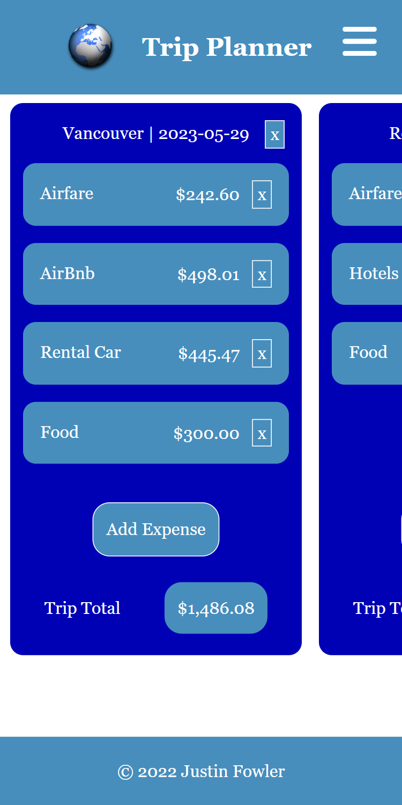
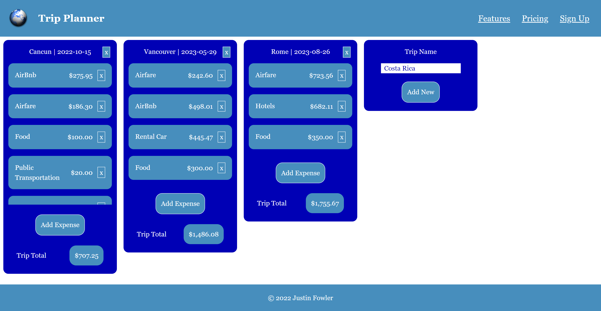

# Trip Planner

## Table of contents

- [Description](#description)
- [Screenshot](#screenshot)
- [Built with](#built-with)
- [Instructions](#instructions)
- [Author](#author)

## Description

This project is a trip planning resource that allows you to create a list of possible trips, add expenses to each trip, and calculate a total cost for the trip. It also includes the ability to remove trips and expenses from the API, and adjust names and pricing for each expense within a given trip. Future releases will include the ability to compare the cost of two or more trips, upload trip photos, and upload documents or other items to individual expenses.

## Screenshot

## Built with

- [React](https://reactjs.org/) - JS library
- [TypeScript](https://www.typescriptlang.org/) - JS Superset
- [Tailwind CSS](https://tailwindcss.com/) - Styles

## Instructions

### API

<pre>
Start API before starting client.
Run "npm install" in trip-planner\api.
Run "npm start" to launch API.
Runs on http://localhost:5000/api/trips.
</pre>

### Client

<pre>
Run "npm install" in trip-planner\client.
Run "npm start" for dev environment.
Run "npm run build" for production environment.
Runs on http://localhost:3000/.
Use http://localhost:3000/?useMockApi=true for loading mock data.
Mock data runs on http://localhost:3001/trips.
</pre>

## Author

- Website - [Justin Fowler Art](https://www.justinfowlerart.com)